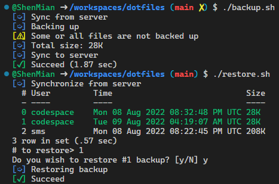

# dotfiles

[个人常用软件](https://shenmian.github.io/notes/%E6%93%8D%E4%BD%9C%E7%B3%BB%E7%BB%9F/%E4%B8%AA%E4%BA%BA%E5%B8%B8%E7%94%A8%E8%BD%AF%E4%BB%B6/)

## Arch Linux

- [ ] 将 `setup.sh` 合并到 `setup.ab`, 然后将 `setup.ab` 编译为 `setup.sh`.
- [ ] 待 Amber 0.4.0 稳定后, 进行升级: <https://docs.amber-lang.com/getting_started/migration_guide>.

> [!WARNING]
> 不要执行 `setup.sh`, 除非你知道你在干什么.  

## Windows

```ps1
Set-ExecutionPolicy -ExecutionPolicy RemoteSigned -Scope CurrentUser
./setup.ps1
```

---

## Legacy scripts

  

| Name       | Description                          |
|------------|--------------------------------------|
| backup.sh  | Backup dotfiles.                     |
| restore.sh | Restore dotfiles.                    |
| update.sh  | Update dotfiles.                     |
| setup.sh   | Set up environment for a new system. |
| preview.sh | Preview file contents.               |
| weather.sh | Get weather.                         |
