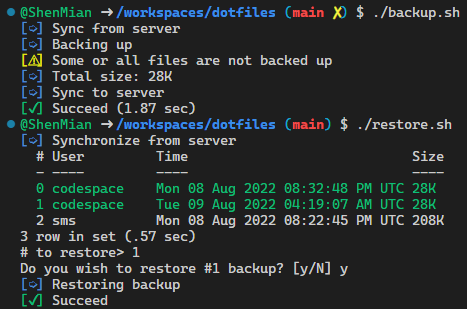

# dotfiles

- **Linux distro**: Manjaro Linux.
- **IDE**: VSCode, Neovim, Zed.
- **Shell**: Fish.
- **Terminal**: WezTerm.
- **Git**: GitHub Desktop, Lazygit.
- **Email**: Thunderbird.

---

## Scripts

  

| Name       | Desc                                 |
| ---------- | ------------------------------------ |
| backup.sh  | Backup dotfiles.                     |
| restore.sh | Restore dotfiles.                    |
| update.sh  | Update dotfiles.                     |
| setup.sh   | Set up environment for a new system. |
| preview.sh | Preview file contents.               |
| weather.sh | Get weather.                         |

> [!WARNING]
> 不要执行 `setup.sh`, 除非你知道你在干什么.  
